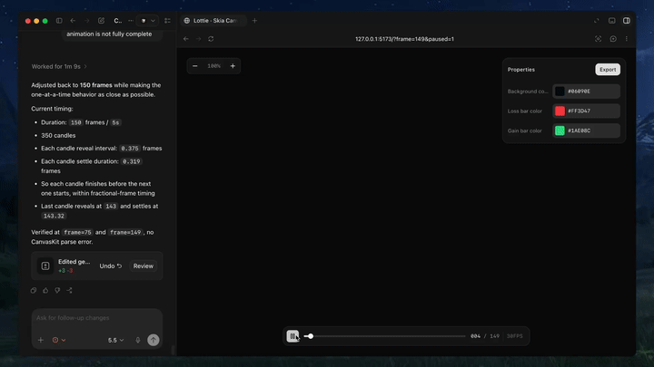
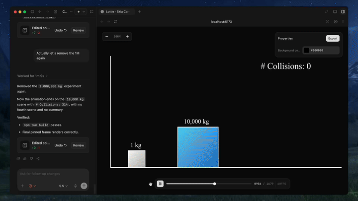

<p align="center">
  
</p>

[](https://discord.com/invite/zPQJrNGuFB)
[](https://x.com/diffusionhq)
[](https://www.ycombinator.com/companies/diffusion-studio)

[English](README.md) | [繁體中文](README.zh-TW.md)

**Text-to-lottie** 是一套開放原始碼框架，可搭配 Claude Code、Codex 或其他支援 Skill 的程式設計 Agent，產生可用於正式環境的 Lottie 動畫。

## 使用 Text-to-Lottie 製作

<table>
  <tr>
    <td>
      
    </td>
    <td>
      
    </td>
  </tr>
</table>

## 快速開始

安裝 Skill：

```bash
npx skills add diffusionstudio/lottie
```

接著請你的程式設計 Agent 使用 `text-to-lottie` 產生 Lottie 動畫。

提示詞範例：

> 使用 https://github.com/JaceThings/SF-Hello/blob/main/SVG/hello-en.svg 中的 SVG 路徑製作 Lottie 動畫。以順著自然路徑方向的動畫逐步顯示該路徑，並套用高質感的 Apple 風格漸層。使用 ease-in-out 時間曲線與透明背景，同時保留原始 SVG 幾何形狀。

Agent 會設定工作區及內附的播放器；在專案中，每段動畫都是一個場景。場景會自動從 `public/projects/<project>/<scene>/lottie.json` 載入，並在 Agent 編輯時即時更新至播放器，讓你能即時檢視、拖曳時間軸及微調產生的 Lottie 動畫。

## 提示詞指南

### 1. 提供具體依據

盡可能提供 SVG、真實資料或螢幕擷取畫面。以具體素材為基礎時，動畫成果會明顯更好。

### 2. 使用動態設計術語

使用 ease-in、ease-out 及 ease-in-out 等動態設計用語描述時間曲線與移動方式。

### 3. 以攝影師的角度思考

專業動態圖像經常仰賴攝影機運動。請在提示詞中加入推鏡、平移、縮放及類似攝影機 Rig 的運動。

### 4. 指定所需控制項

依預設，輸出通常只會提供背景色彩控制項。如果想自訂其他屬性，請明確要求 Agent 為這些屬性建立控制項。

### 5. 指定 FPS 與時間長度

如果動畫需要特定的影格速率或長度，請在提示詞中提供所需 FPS 與總影格數。

## 使用產生的動畫

產生的動畫可直接作為 Lottie JSON 檔案使用，也能匯入 After Effects 進一步微調。

### Web / 原生 HTML

```html
<script src="https://unpkg.com/lottie-web/build/player/lottie.min.js"></script>

<div id="anim"></div>

<script>
  lottie.loadAnimation({
    container: document.getElementById("anim"),
    renderer: "svg",
    loop: true,
    autoplay: true,
    path: "/animations/my-animation.json"
  });
</script>
```

### React Native

使用 [React Native Skia](https://shopify.github.io/react-native-skia/docs/skottie/) 的 Skottie 模組算繪 Lottie 動畫。它支援 iOS、Android 及 Web，並可在執行階段自訂動畫屬性、素材與字型排印。

```tsx
import { Skia, Canvas, Skottie, useClock } from "@shopify/react-native-skia";
import { useDerivedValue } from "react-native-reanimated";

const animation = Skia.Skottie.Make(JSON.stringify(require("./animation.json")));

export default function Loader() {
  const clock = useClock();
  const frame = useDerivedValue(
    () => ((clock.value / 1000) % animation.duration()) * animation.fps()
  );
  return (
    <Canvas style={{ width: 200, height: 200 }}>
      <Skottie animation={animation} frame={frame} />
    </Canvas>
  );
}
```

### iOS Swift

```swift
import Lottie

let animationView = LottieAnimationView(name: "animation")
animationView.frame = view.bounds
animationView.contentMode = .scaleAspectFit
animationView.loopMode = .loop
view.addSubview(animationView)
animationView.play()
```

### Android Kotlin

```kotlin
val view = findViewById<LottieAnimationView>(R.id.animationView)
view.setAnimation(R.raw.animation)
view.loop(true)
view.playAnimation()
```

### Flutter

```yaml
dependencies:
  lottie: ^1.0.0
```

```dart
import 'package:lottie/lottie.dart';

Lottie.asset('assets/animation.json')
```
