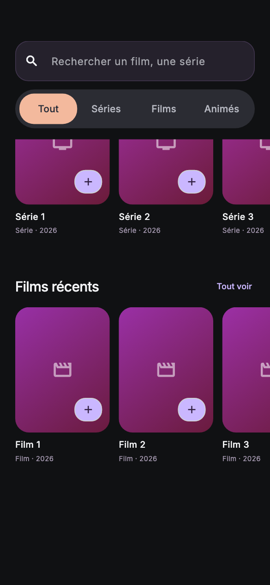
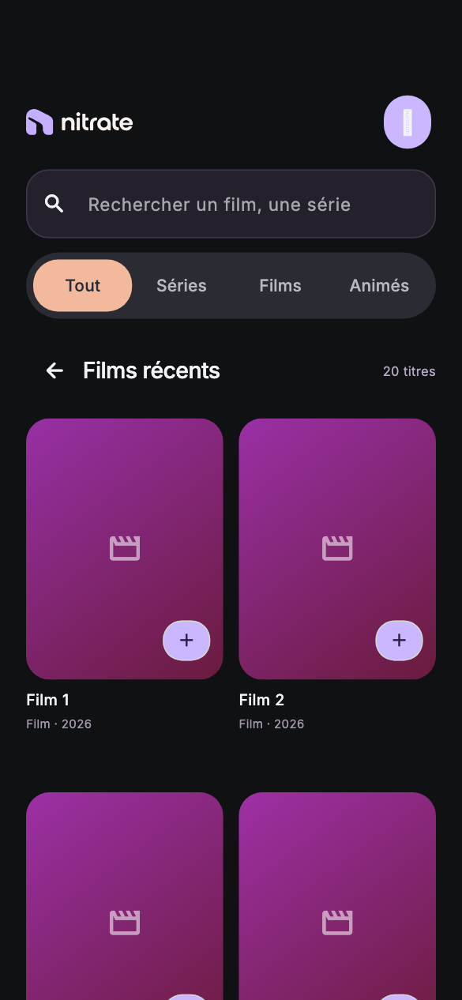
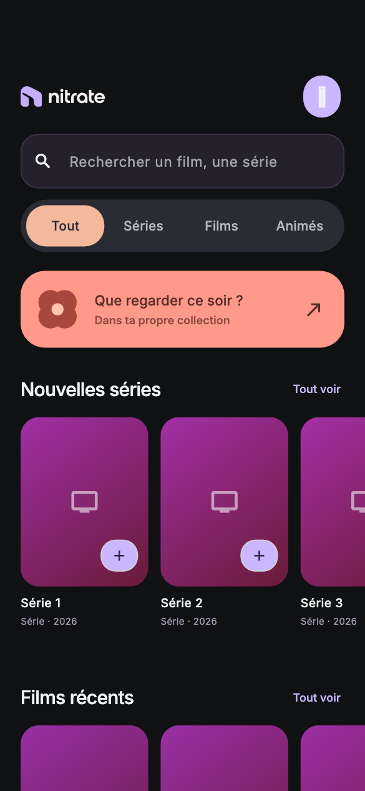
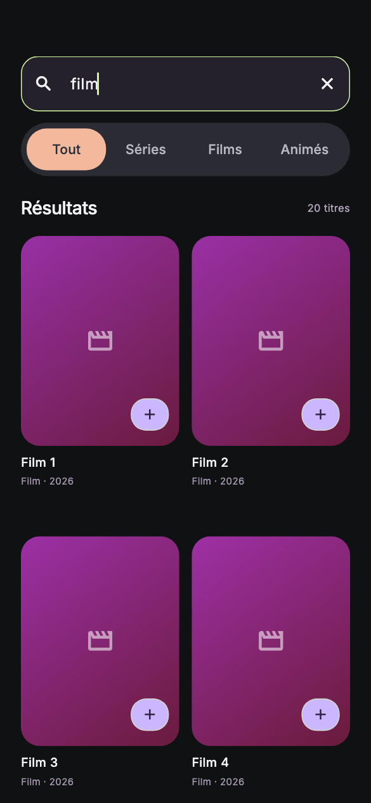
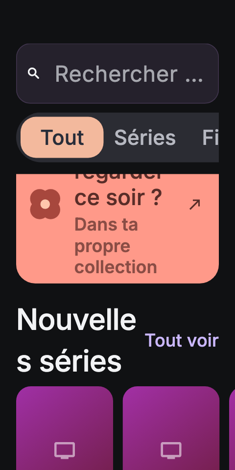

# Explorer : défilement et cache des images

Audit du 14 septembre 2026. Le contrôle iPhone via MobAI répond HTTP 402
`device_limit_reached`. Les captures de cette exécution viennent du véritable
widget Explorer dans le moteur de test Flutter, avec Inter, les icônes Material,
une zone sûre de 59 px et des données fictives. Les affiches montrent le repli
normal de l’app sans réseau. L’emoji de profil n’est pas rendu par cette police
de test. La navbar native, le clavier système et les performances du téléphone
ne sont pas reproduits. Aucune modification des données réelles.

La structure Sliver est adaptée : un défilement vertical principal, une
recherche épinglée, des grilles et carrousels construits à la demande. Le travail
prioritaire porte sur la continuité de navigation et les images, plutôt que sur
un remplacement de cette structure.

1. **Arrivée — correcte.** Recherche, filtres, « Que regarder ce soir ? », puis
   nouveautés. La carte est bien sous les filtres. Format local : 390 × 844.

   

2. **Défilement — fonctionnel, header assez haut.** Recherche et filtres restent
   à y=59, sans débordement. Leur hauteur fixe est de 142 px. Une forme plus
   compacte pourrait laisser davantage de place aux affiches ; garder les
   filtres accessibles et respecter les tailles tactiles.

   

3. **Tout voir — retour difficile après défilement.** La grille charge ses
   éléments à la demande. Mais la ligne « Films récents » et son bouton retour
   ne sont pas épinglés : après 581 px de défilement le retour n’est plus
   touchable. Prévoir un retour à la découverte toujours accessible.

   

4. **Retour à la découverte — perte de position confirmée.** La position était
   à 331 px avant « Tout voir » ; elle revient à 0. `_toTop()` impose ce retour.
   Conserver une position propre à la découverte et la restaurer en quittant
   la grille, plutôt que de ramener l’utilisateur au début.

   

5. **Recherche — fonctionnelle, changement de géométrie abrupt.** La première
   saisie retire immédiatement la ligne Nitrate : le champ passe de y=143 à
   y=59, soit 84 px. Une transition maîtrisée ou une géométrie stable rendrait
   ce passage plus doux. La fermeture du clavier au toucher extérieur est
   couverte par les tests Explorer ; le clavier natif n’a pas été filmé ici.

   

6. **Texte doublé — utilisable, densité à améliorer.** À 320 × 640, le header
   épinglé occupe 178 px. Les filtres défilent horizontalement ; Films et Animés
   ne sont pas tous visibles en même temps. Le titre « Nouvelles séries » se
   coupe maladroitement en face de « Tout voir ». Prévoir une ligne d’action
   séparée à grande police. Aucun RenderFlex overflow dans le scénario.

   

## Cache : état constaté dans le code

- **Images en mémoire : présent.** `MediaImage` utilise `Image.network`, donc
  le cache partagé Flutter. Une image déjà décodée et conservée peut réapparaître
  sans nouveau fondu. Les réglages du SDK local restent ceux par défaut :
  1 000 entrées / 100 Mio pour le cache keepAlive. Ce n’est pas un plafond de
  mémoire total : les images encore écoutées peuvent rester vivantes à côté.
- **Cache disque des affiches distantes : absent.** Aucun gestionnaire de
  fichiers images ni fournisseur persistant dans l’app. La base conserve les
  URLs et métadonnées, pas les fichiers des affiches. Après éviction ou nouveau
  lancement, des téléchargements peuvent être nécessaires.
- **Décodage des petites cartes : à optimiser.** `MediaImage`, les cartes,
  `HeroArtwork` et les autres `Image.network` ne renseignent pas de résolution
  de décodage adaptée. Une image source volumineuse peut donc coûter beaucoup
  plus de mémoire que sa petite taille à l’écran ne le suggère.
- **Données API : cache utile déjà présent.** Recherches 10 min, découverte
  6 h, détails 24 h, épisodes 6 h, traductions 7 jours. Les appels simultanés
  identiques sont regroupés, avec données périmées en repli si autorisé.
  La map mémoire n’a pas de limite de nombre d’entrées ni purge automatique
  des clés expirées : le TTL contrôle la fraîcheur, pas la taille du cache.
- **Couleurs des images : cache de session présent.** Les calculs concurrents
  sont regroupés. Dans `swatchesOfImage`, seule l’image miniature est explicitement
  libérée ; la référence reçue par `_resolve` ne l’est pas. Le contrat Flutter
  demande au destinataire du listener de libérer cette référence. À corriger ;
  aucune consommation mémoire réelle ni fuite persistante n’a été mesurée.

Priorité proposée : cache disque borné avec durée de conservation, décodage
adapté aux cartes et libération des images d’analyse ; puis restauration du
défilement, retour toujours disponible et transition du header de recherche.
Garder la bonne qualité des affiches sur les fiches et éviter de gonfler
simplement le cache mémoire global.

Sources locales : `app/lib/widgets/media_image.dart`, `app/lib/widgets/hero_artwork.dart`,
`app/lib/media/palette.dart`, `app/lib/tmdb/tvdb.dart`,
`app/lib/screens/explorer_screen.dart` ; SDK Flutter 3.41.9 :
`painting/image_cache.dart`, `painting/_network_image_io.dart`, `painting/image_stream.dart`.
Les [mesures brutes](mesures.json) et les six captures appartiennent à cette exécution.

Validation : scénario local complet réussi, six captures ouvertes et inspectées.
Aucune optimisation appliquée à l’app pendant cet audit. Les gains en FPS,
mémoire, téléchargements et autonomie restent à mesurer sur appareil.
